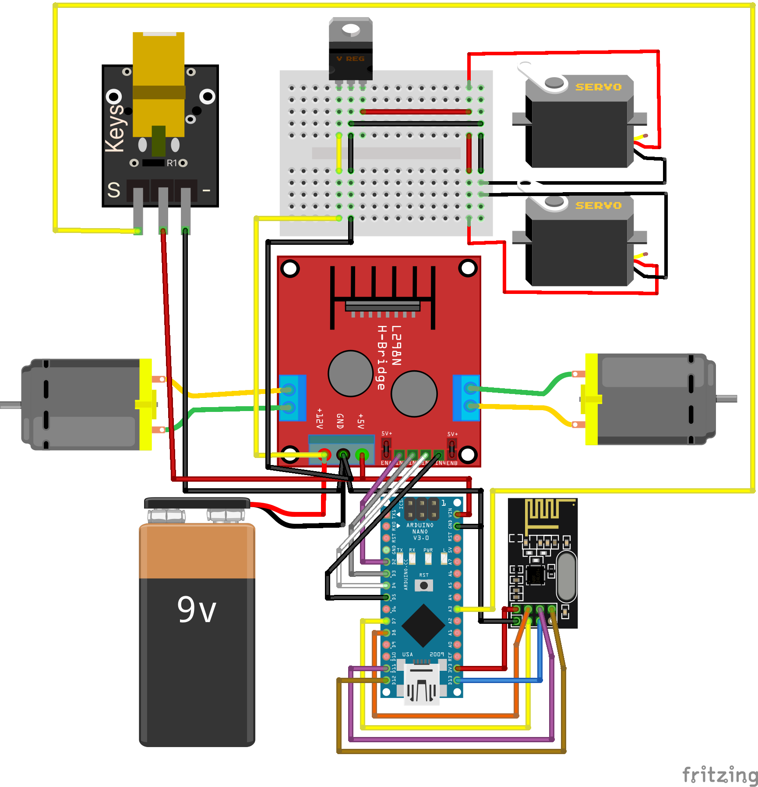
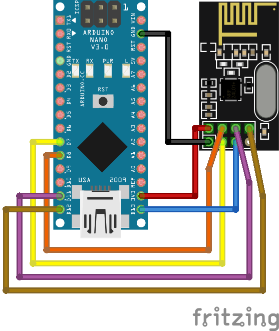
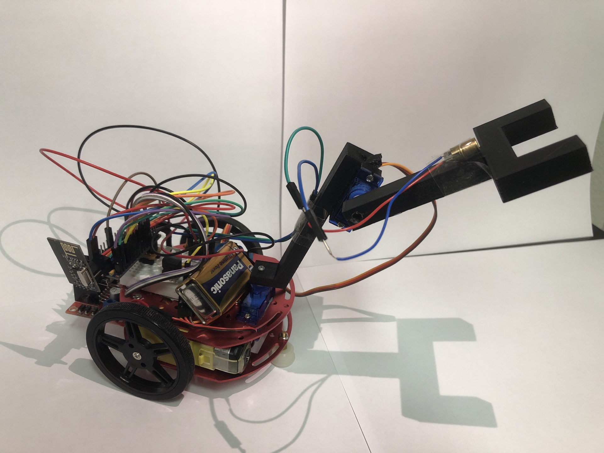

# Athens-Arduino-Project
This is the code and wiring used for the Arduino poject of the course UPM-115 during the ATHENS-Program. 
This project was made by João and Steven.

## Wiring
### Car wiring

### Transmitter wiring

## Result

